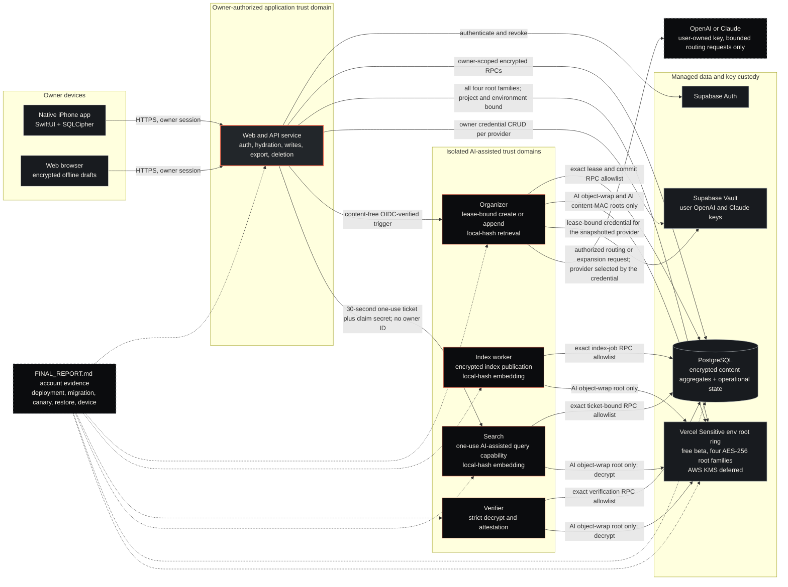

# Unfiled system architecture

This is the public, high-level architecture view for Unfiled. It explains where content may flow, where it must not flow, and which boundaries still require deployed account evidence.

The diagram source is [diagrams/unfiled-system.mmd](./diagrams/unfiled-system.mmd). The deeper cryptographic and authorization details remain in [ENCRYPTION_ARCHITECTURE.md](./ENCRYPTION_ARCHITECTURE.md), [SECURITY_AND_PRIVACY.md](./SECURITY_AND_PRIVACY.md), and the linked architecture decision records. The free-beta custody and retrieval decision is [ADR-0016](./decisions/ADR-0016-free-beta-vercel-sensitive-key-custody-and-local-hash-retrieval.md); the dual-provider settings decision is [ADR-0015](./decisions/ADR-0015-user-selectable-provider-model-effort.md).

## Claim boundary

The topology and code paths below are implemented in the repository. The five Vercel projects exist in team `zach-2267`; the diagram is **not** evidence that specific deployments, migrations, provider controls, domains, mailboxes, backups, or signed Apple artifacts are deployed and proved. That evidence is recorded in `FINAL_REPORT.md`.

Unfiled uses application encryption at rest with authorized server-side decryption. It is not end-to-end encrypted or zero knowledge. The owner-authorized application service can decrypt content needed for reads, writes, export, and deletion. Isolated AI services receive only narrower capabilities.

## Free private-beta topology

- **Key custody:** `UNFILED_KEY_CUSTODIAN=vercel-sensitive-env-v1`. Four independent AES-256 root families (AI object-wrap, AI content-MAC, private-manual object-wrap, private-manual content-MAC) exist only in Vercel Sensitive Environment Variables, bound to the exact Vercel project ID and the `production` environment. Each workload receives only the subset it needs. AWS KMS/Terraform (`infra/aws-kms`) is preserved as deferred paid hardening and is not required or applied for this beta.
- **Provider:** bring-your-own-key only. A user saves an OpenAI key, a Claude (Anthropic) key, or both in Supabase Vault and chooses Provider, Model, and Effort. The organizer resolves one credential under a live job lease; the credential's provider selects the adapter, so a Claude key can never reach OpenAI and vice versa. No app-funded provider key is configured in the free beta.
- **Retrieval:** `unfiled-local-hash-v1` (512 dimensions) in the worker, search, organizer, and the web generation lifecycle. It is a deterministic, provider-neutral feature-hash vector computed in process: no note or query text is sent to a provider merely for retrieval, and no provider key is needed. It is not an AI semantic embedding and its relevance is weaker than a semantic embedding; paraphrases and synonyms do not match.
- **Database:** one free remote Supabase project is the Production database; local Supabase is Development. Vercel Preview deployments are intentionally not built, so only one custodian ever targets the shared database.

## Diagram

Solid arrows describe intended implemented data or capability paths. Dotted arrows from the evidence node mean that real account, device, or operational proof is recorded in `FINAL_REPORT.md` rather than inferred from this diagram. Styling is descriptive only; the accessible text below is authoritative.

## Accessible text alternative

### Components

1. The native app ships no widget or app extension; capture happens only inside the signed-in app (the Lock Screen widget was removed on 2026-09-02, ADR-0017).
2. The native iPhone app stores its local capture outbox and note cache in SQLCipher under a device-generated Keychain-held key. The browser separately encrypts offline draft content using Web Crypto.
3. Both clients communicate over HTTPS with the owner-authorized web/API service. The service authenticates the owner, hydrates authorized reads, performs encrypted writes, coordinates export and deletion, and is the only public application trust domain shown here.
4. Supabase Auth owns user authentication. PostgreSQL stores encrypted content aggregates and content-free operational state. Supabase Vault is the accepted store for user-supplied OpenAI and Claude credentials, addressed per provider. In the free beta the four content root families live in a Vercel Sensitive environment root ring bound to the exact project ID and `production` environment; AWS KMS is the deferred paid alternative.
5. Organizer, index worker, verifier, and search are four separate isolated services. Each has a different Vercel project, a different PostgreSQL login with an exact RPC allowlist, and a different root-key subset: the organizer receives the AI object-wrap and AI content-MAC roots; the worker, verifier, and search receive the AI object-wrap root only; web receives all four.
6. OpenAI or Anthropic receives content only for an authorized AI-assisted routing or expansion request made with the user's own key. The credential's provider selects the adapter; a Claude key never reaches OpenAI, an OpenAI key never reaches Anthropic, and neither key ever reaches retrieval. Private-manual content and private-intent queries must not enter an isolated AI service or provider request.

### Capture and organization flow

1. A client saves a capture locally before network organization is complete.
2. The client sends the capture to the owner-authorized web/API service using the authenticated owner session. The request does not authorize a different owner supplied in content.
3. The application seals or opens content only within the required owner, resource, revision, content-kind, and key-class context.
4. When the capture is accepted, the job snapshots the owner's provider, model preference, resolved model ID, effort, expansion, settings revision, and registry version immutably. Keys are never in jobs. For an AI-assisted capture, web sends the organizer a content-free trigger authenticated by the checked-in app-level Vercel OIDC verifier. The organizer derives owner and content capability from a live database lease rather than from an HTTP owner identifier.
5. The organizer resolves the snapshotted provider's credential under the live lease, then discloses only the bounded, revalidated AI-assisted request to that provider: OpenAI through the Responses API with strict Structured Outputs, or Anthropic through the Messages API with one forced strict tool. It validates provider output as untrusted data, prepares stable database-owned identities, and commits the note, revision, decision, receipt, Review state, and index work atomically. Without a usable key the job fails closed and non-retryably to Inbox and the UI asks the user to add a key.
6. For private-manual content, the organization worker and AI provider are bypassed. Owner-authorized manual reads, writes, search, export, and deletion remain available through the application service.

### Index and verification flow

1. The index worker claims bounded index work through its exact database capability.
2. It decrypts the minimum current AI-assisted note projection, computes the `unfiled-local-hash-v1` vector in process (no provider request), encrypts the resulting index document, and publishes only ciphertext and content-free lifecycle state.
3. A separate verifier pages one shadow generation, decrypts and strictly validates every projected document, and submits an attestation. It cannot publish index content or activate arbitrary data.
4. Stale, incomplete, failed, or changing generations cannot authorize AI-assisted results. Search degrades to the owner-authorized lexical path.

### User hybrid-search flow

1. The owner chooses either all-notes lexical search or the explicit AI-assisted scope.
2. Only the explicit AI-assisted scope may cause web to mint a 30-second, one-use database ticket.
3. Web calls the isolated search service with the ticket, a random claim secret, and the exact normalized query request. It does not send an owner ID.
4. Search recomputes the request digest, claims the ticket once, uses only the ticket-derived owner/generation/filter bounds, computes the local-hash query vector in process, decrypts bounded current AI-assisted index rows, ranks them in request memory, and revalidates selections.
5. Search returns bounded identifiers, revisions, scores, and cursor state. The owner-authorized web service hydrates current note content and rejects stale or unauthorized references.
6. Omitted, mixed, private-manual, stale-generation, dependency-failure, digest-failure, and cursor-failure cases remain lexical-only. The query service keeps no cross-request plaintext cache. Because the free-beta vector is a lexical feature hash, the AI-assisted scope is lexical-strength retrieval and must not be described as semantic search.

### Export and deletion flow

1. Export is initiated by the authenticated owner at the application boundary. It decrypts authorized content into a bounded human-readable stream and never exports encryption keys or provider credentials.
2. Account deletion revokes sessions, cancels or invalidates work, removes live owner data and derived indexes, destroys live Vault credentials, and records only the permitted content-free receipt.
3. Backup copies expire under the published retention window. Deletion must not be described as immediate erasure from every historical backup unless independent cryptographic erasure is actually proved.

## Trust-domain capability summary

| Domain             | Receives                                                                                                                                                                             | Must not receive or control                                                                                                                                                       |
| ------------------ | ------------------------------------------------------------------------------------------------------------------------------------------------------------------------------------ | --------------------------------------------------------------------------------------------------------------------------------------------------------------------------------- |
| Web/API            | Authenticated owner session; owner-authorized plaintext in bounded memory; encrypted aggregates; all four root families; all application operations                                  | A client-supplied owner ID as authority; plaintext logs; unsupported production fallback; managed AI fallback unless `UNFILED_MANAGED_AI_FALLBACK_AVAILABLE` is set               |
| Organizer          | Content-free OIDC-verified trigger; lease-derived AI-assisted projection; AI object-wrap and AI content-MAC roots; one lease-bound user credential for the snapshotted provider only | Browser session, HTTP owner ID, private-manual roots/content, broad database credential, any Anthropic environment variable, arbitrary provider or endpoint, cross-provider model |
| Index worker       | Bounded AI-assisted index job and current encrypted projection; AI object-wrap root only                                                                                             | Private-manual content/root, content-MAC authority, provider key, owner session, broad database or activation authority                                                           |
| Verifier           | Bounded shadow-generation ciphertext; AI object-wrap root only (decrypt)                                                                                                             | Index writes, generation activation, data-key generation, private roots, content-MAC authority, provider key                                                                      |
| Search             | One-use ticket, random claim secret, exact AI-assisted request, bounded encrypted active-index rows; AI object-wrap root only (decrypt)                                              | Owner ID, BYOK, private-manual content/root, note writes, repair/publication/activation, reusable ticket, broad database access, provider key                                     |
| OpenAI             | Only the bounded routing/expansion request permitted by the selected AI-assisted action, authenticated with the user's own OpenAI key                                                | Private-manual content, retrieval text, a Claude key, authentication tokens, database/root credentials, arbitrary tools, or an E2EE claim                                         |
| Anthropic (Claude) | Only the bounded routing/expansion request permitted by the selected AI-assisted action, authenticated with the user's own Claude key                                                | Private-manual content, retrieval text, an OpenAI key, authentication tokens, database/root credentials, parallel or arbitrary tools, or an E2EE claim                            |

## Deployment-evidence overlay

Before presenting this as a production architecture, `FINAL_REPORT.md` must link non-secret evidence for:

- the exact five Vercel projects, aliases, deployment IDs, commits, and the Deployment Protection setting that protects Preview deployments only;
- the exact PostgreSQL identities and their eleven-, six-, two-, and five-RPC allowlists on the shared beta database;
- the Vercel Sensitive root ring per workload (IDs and status only, never material) and the app-level OIDC verifier results;
- remote application of migrations `20260902000000` and `20260902000001`, Supabase Auth, Vault, backup, and contraction state;
- provider-key entry through the product UI and live canaries for both providers;
- monitoring, alerting, rotation, deletion, and backup-expiry drills; and
- signed native archive identifiers plus physical-device behavior.

Until then, the correct label is **production-shaped architecture implemented in code; deployment proof recorded in `FINAL_REPORT.md`**.
